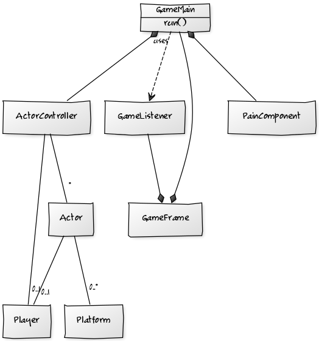

#Aihe
Impossible game tyylinen peli, jossa pelaaja yrittää selviytyä mahdollisimman kauan vaikeustason kasvaessa.
Pelissä pelaaja ei pysty liikkumaan sivuttain, vaan kenttä ikäänkuin rullaa pelaaja päin oikealta vasemmalle.
Pelissä on high score -lista johon tallennetaan parhaimmat suoritukset, score säilyy kentästä toiseen 
ja nollaantuu vain pelaajan kuollessa. :trophy:
[Tässä linkki projektin inspiraatioon.](http://impossiblegame.org/the-impossible-game/)

#Ohjelman rakenne

#Ohjelman toiminta

#Käyttäjät: 
* Pelaaja

#Käyttäjän toiminnot
* Käyttäjä käynnistää ohjelman
* Toiminnot valikossa
 * Pelaaja valitsee pelimuodon
 * Pelaaja avaa high score -listan
 * Pelaaja aloittaa uuden pelin
* Toiminnot pelissä
  * Pelaaja kontrolloi hahmoaan hyppimällä, ja pyrkii pysymään hengissä mahdollisimman kauan
  * Pelaaja ei pysty liikkumaan sivuittain
* Käyttäjän tavoite
 * Tarkoituksena on päästä pelin jokainen kenttä lävitse
 * Saada uusi high score

#Valikko
* Valikosta voi valita mitä kenttää haluaa pelata.
* Valikosta pääsee selamaan high score -listaa.
* Uudet pelimuodot ilmestyvät valikkoon jahka niitä tulee lisää

#Kentät
Pelissä on erilaisia kenttiä, jotka kaikki poikkeavat toisistaan.
Kentät sisältävät alustan jolla pelaaja matkaa, sekä esteet joita pelaajan tulee vältellä.

#Jatkokehitys ideoita
* Endless mode - Peli, joka jatkuu kunnes pelaaja kuolee
  * Valikkoon pitää lisätä pelimuodon valinta
* No gravity mode - Pelissä ei ole pelaajan vaikuttavaa painovoimaa
  * Pelin luonne muuttuu kun pelaaja ei kontrolloikaan hahmoaan vain hyppimällä
* Boundless mode - Peli, jossa pelaaja kykenee liikkumaan myös sivuittain
