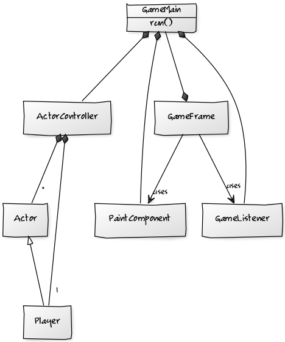
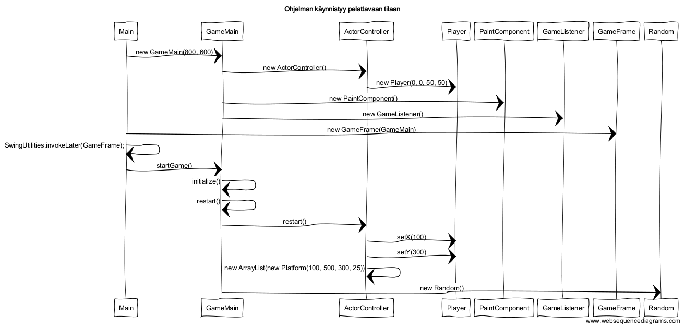
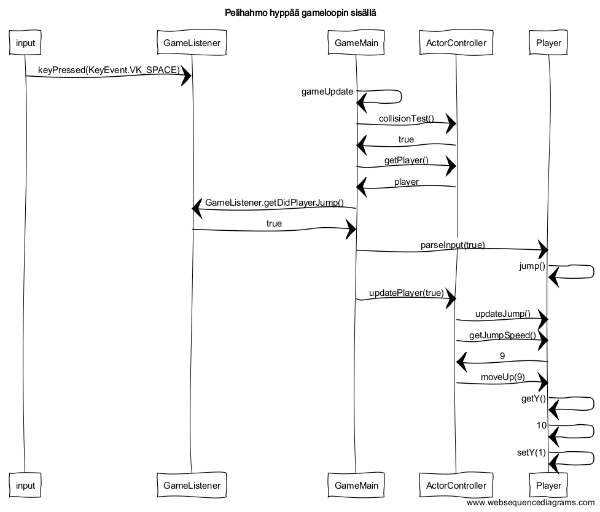

#Aihe
Tasohyppelypeli, jossa pelaajan on tarkoitus selviytyä mahdollisimman kauan vaikeustason kasvaessa. Pelaaja saa sitä paremmat pisteet suorituksestaan, mitä kauemmin hän selviytyy. Pelissä pelaaja ei pysty liikkumaan sivuttain, vaan pelialue ikäänkuin rullaa pelaaja päin oikealta vasemmalle.

#Ohjelman rakenne

Ohjelman käynnistyessä alustetaan GameMain-olio ja se annetaan GameFrame-oliolle parametrina. GameMain alustaa pelin logiikan ja sen tarvitsemat oliot (ActorController, GameListener), sekä grafiikka olion joka annetaan myös GameFramelle. GameFrame paketoi ohjelmaikkunan ja PaintComponent grafiikka renderöijä -olion. 

Ohjelma toimii GameMainin gameStart() ja gameUpdate() -loopeissa. Yksi kokonainen gameStart() kierto vastaa pelissä yhtä päivityskierrosta. gameStart() sisältää pelin tauottamiseen ja jatkamiseen liittyvän logiikan. gameUpdate() taas kutsuu vuorotellen jokaista GameMainissa alustettua olioa:
* ActorController hoitaa vuorollaan pelihahmojen sijainnin päivittämisen, uusien hahmojen lisäämisen ja osumatestit.
  * ActorController sisältää listan päivitettävistä Actoreista.
  * Player on Actorin alaluokka.
* PaintComponent renderoi uuden pelitilanteen jokaisella päivitys kierroksella. 
* Riippumattomana GameMainin peliloopista toimii taustalla GameListener, joka kuuntelee näppäimistön painalluksia, ja reagoi mikäli tiettyjä näppäimiä painetaan.
  * Näppäinten painallusten mukaan toimitaan joka päivityskierroksella. Riippuen mitä näppäintä on painettu GameListener palauttaa boolean-arvoja, jotka kuvaavat pelaajan komentoja: hyppy, pelitauko, uusi peli, taikka sammuta ohjelma.

#Ohjelman toiminta

(huom! Ei sisällä newGame looppia)

#Käyttöohje

#Käyttäjät
* Pelaaja

#Käyttäjän toiminnot
* Käyttäjä käynnistää ohjelman
 * Aloitusnäkymästä peliin pääsee painamalla 'A' 
* Toiminnot pelissä
  * Pelaaja kontrolloi hahmoaan hyppimällä, ja pyrkii välttämään häviämistä mahdollisimman kauan
  * Pelaaja ei pysty liikkuttamaan hahmoaan sivuttain
  * Pelaaja voi laittaa pelin tauolle, ja high score tulee näkyviin *(implementoi!)*
* Käyttäjän tavoite
 * Saada uusi high score

#Kenttä
Kenttä sisältää alustoja joilla pelaaja matkaa. Kenttää generoidaan satunnaisesti pelin edetessä.

#Jatkokehitys ideoita
* Endless mode - Peli, joka jatkuu kunnes pelaaja kuolee
* No gravity mode - Pelissä ei ole pelaajan vaikuttavaa painovoimaa
  * Pelin luonne muuttuu kun pelaaja ei kontrolloikaan hahmoaan vain hyppimällä
* Boundless mode - Peli, jossa pelaaja kykenee liikkumaan myös sivuittain
